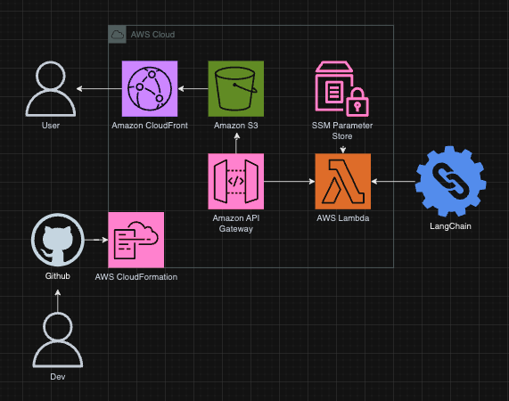

# Running Langchain LLM

## Introduction

This project provides a way to talk with experts about running using LangChain and LLM models.

### Objectives & Key Results

1. Provide a use case of using LLMs in every day scenarios.
2. User interface to interact with the platform.

### Key Performance Indicators

1. Deploy system within minutes.

## Launch Configurations

### Pre-requisites

- python == 3.11
- aws-cli
- aws-cdk >= 2.128.0
- git
- jq >= 1.7.1

Run the following command:

```bash
aws configure
```

### Deployment

1. Create an [Open AI API Key](https://openai.com/blog/openai-api)

2. Generate a [Hugging Face API token](https://huggingface.co/docs/hub/en/security-tokens)

3. Generate the `secret_env.sh` after replacing the placeholders below using the following commands:

```bash
OPEN_API_KEY="example"
HUGGINGFACEHUB_API_TOKEN="example"
./scripts/generate_secret_env.sh $OPEN_API_KEY $HUGGINGFACEHUB_API_TOKEN
```

4. Run the deployment script.

```bash
./scripts/deploy.sh
```

### Teardown

Run the following command to teardown the portfolio application:

```bash
./scripts/teardown.sh
```

## Architecture Overview

<!-- Upon pushing to the Github master branch, Amplify will retrieve the latest branch changes. These changes are processed through a CI/CD pipeline built into AWS Amplify. To retrieve credentials securely, the system uses the SSM Parameter Store. This is then routed through to Amazon Route 53 to provide DNS hosting capabilities for users to access. -->



### Code Layout

| Path      | Description                                                    |
| :-------- | :------------------------------------------------------------- |
| cdk/      | AWS CDK source code                                            |
| cicd/     | Amplify buildspec code                                         |
| docs/     | supporting assets and docs for documentation.                  |
| frontend/ | source code for NextJS frontend                                |
| scripts/  | shell scripts to build, deploy, and interact with the project. |

### Design Decisions

_Langchain_

Open source framework allowing AI developers to combine LLMs like GPT-4 with external sources of computation and data.

_CloudScape_

Open source frontend framework for components to render frontend.

<!-- This portfolio is a static website which is best suited for sever-side rendering. Between ReactJS and NextJS, NextJS offers better server-side rendering. NextJS is a framework used to build UI and pages for the web app within the React Library. -->
